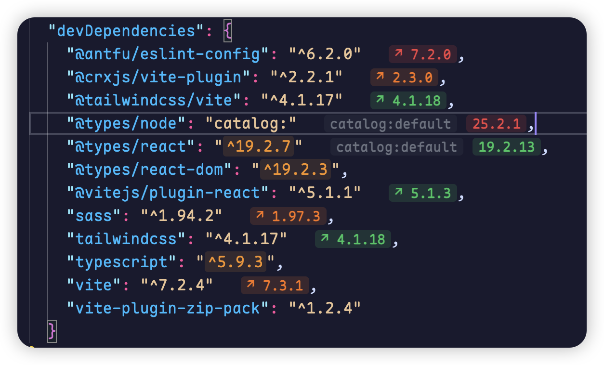
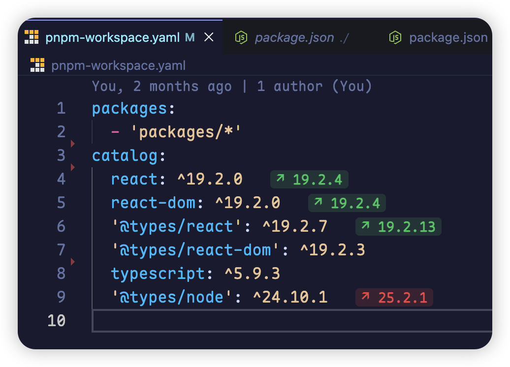
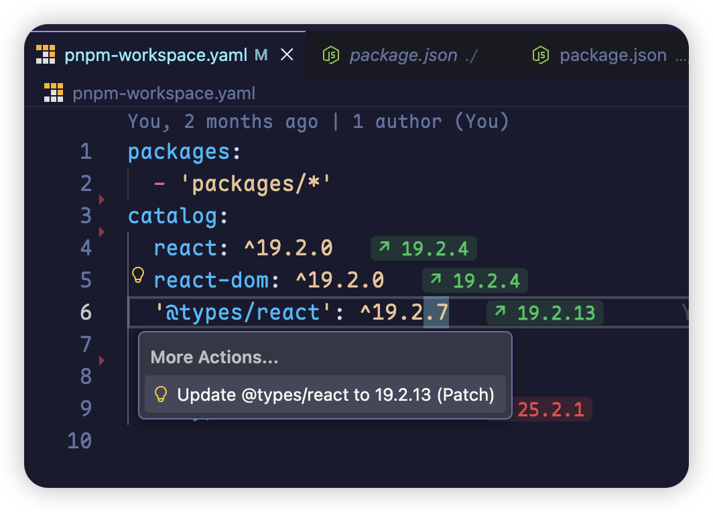

# package-check — VS Code extension

Package Check is a Visual Studio Code extension that detects available updates for dependencies declared in `package.json` and `pnpm-workspace.yaml` (catalogs), provides inline update tags, and offers quick fixes for safe upgrades.

## Features

- Visual inline tags showing available updates with three severity levels:
  - Major (red) — major version bump
  - Minor (orange) — minor version bump
  - Patch (green) — patch update
- Catalog-aware rendering for `catalog:` entries — catalog tags are visually separated and do not provide Quick Fixes (since catalog updates are managed in the workspace file).
- Quick Fix code actions for non-catalog dependencies with three options:
  - `^` (lock major) — allows minor and patch updates
  - `~` (lock minor) — allows patch updates only
  - exact — locks to exact version
- Uses `fast-npm-meta` to fetch registry metadata and supports caching for performance.

## Usage

- Open a `package.json` or `pnpm-workspace.yaml` file. If updates are available, tags are shown next to dependency version fields. Use the Code Action (lightbulb) on a dependency to apply updates.

## Screenshots

## Development

- Run `pnpm run dev` to start the watch build.
- Build for publishing with `pnpm run build` and package with `vsce package --no-dependencies`.

## License

MIT
